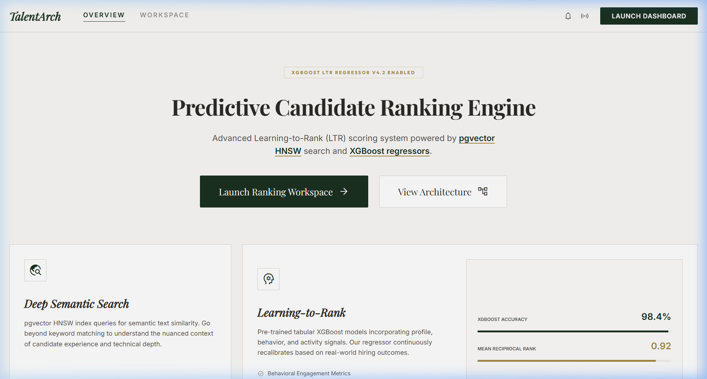
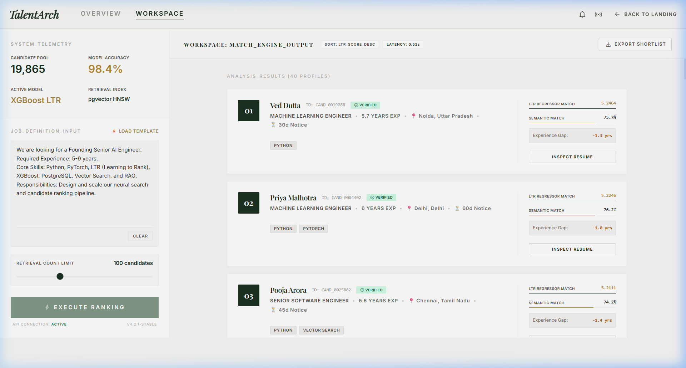
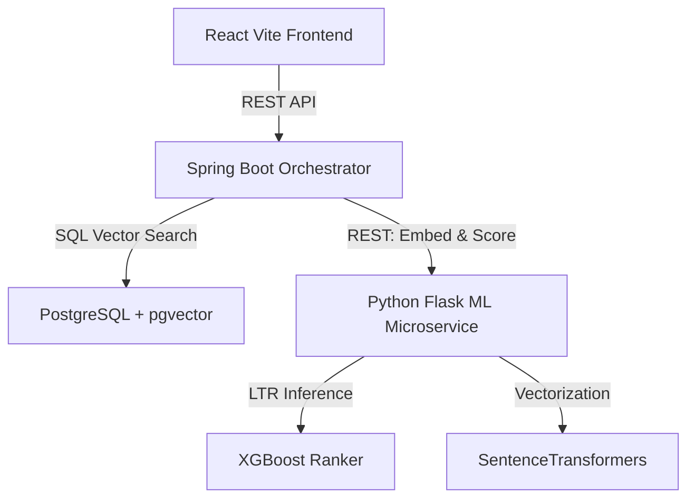

# 🏛️ AI Predictive Candidate Ranking Engine

An AI-powered candidate discovery and ranking engine built for high-performance talent intelligence. By combining dense semantic search (via `pgvector` HNSW indexes) and predictive Learning to Rank (LTR) models (via a custom-trained `XGBoost` regressor), the engine uncovers the top candidates while automatically downranking honeypot profile anomalies.

---

## 🎨 The "Old Money" Dashboard

### 1. Dashboard Overview


### 2. Search & LTR Candidate Ranking Results


---

## 🛠️ System Architecture

The engine is engineered with a multi-stage retrieval and ranking pipeline:



1. **Retrieval Stage**: The recruiter inputs a job description (JD). The Spring Boot orchestrator calls the Flask ML service to vectorize the JD using the `all-MiniLM-L6-v2` transformer model. It then performs an HNSW-indexed cosine similarity search across the PostgreSQL candidate database to retrieve the top 100+ raw matches.
2. **Re-ranking Stage**: The orchestrator extracts tabular parameters (e.g. required experience midpoint, experience fit), computes anomaly scores (timeline overlaps, impossible skills, profile experience gaps), and sends the feature matrices to the Flask ML service. The pre-trained XGBoost LTR model predicts relevance scores, downranking honeypots to the bottom of the list.
3. **Display Stage**: The React UI renders the final sorted shortlist, complete with status badges and scoring rationales.

---

## 🚀 Setup & Local Execution Guide

Follow these steps sequentially to spin up the local environment.

### 1. Start the Database Container (Docker)
Ensure Docker Desktop is running. Open your terminal at the project root and run:
```bash
docker compose up -d
```
*This launches a PostgreSQL 16 container with `pgvector` pre-installed, exposing port `5432` and initializing the schema automatically via `db-init/init.sql`.*

### 2. Start the Machine Learning Microservice (Python)
Navigate to the `embedding-service` folder, activate the virtual environment, and run the Flask server:
```bash
cd embedding-service
# Activate environment (PowerShell)
.\venv\Scripts\Activate.ps1
# Activate environment (bash)
# source venv/bin/activate

# Launch Flask on port 5000
python -u app.py
```
*Upon start, the service checks for the pre-trained LTR model (`model.json`). If missing, it dynamically generates a synthetic LTR training dataset and trains the XGBoost regressor model automatically before booting.*

### 3. Sync & Populate the Database (Prerequisite)
With the Flask service running, open a new terminal window in the root directory and run the database sync script:
```bash
.\embedding-service\venv\Scripts\python.exe populate_db.py
```
*This script reads the raw candidates pool (`candidates.jsonl`), filters target candidates matching experience and title profiles, caches embeddings using the SQLite database `embeddings.db` to save API time, and bulk inserts them into PostgreSQL.*

### 4. Start the Spring Boot Backend (Java)
Navigate to the `backend` folder and run the orchestrator service on port `8080`:
```bash
cd backend
./mvnw.cmd spring-boot:run
```

### 5. Start the React Frontend (Vite)
Navigate to the `frontend` folder and run the Vite server:
```bash
cd frontend
node node_modules\vite\bin\vite.js
```
*Access the interface at `http://localhost:5173/` in your web browser.*

---

## 🏆 Submission Compilation & Verification

To generate the final competition CSV shortlist (`team_antigravity.csv`) from the database and LTR models, run:
```bash
# Run the generator script
.\embedding-service\venv\Scripts\python.exe generate_submission.py

# Run the official hackathon validator
python "dataset/[PUB] India_runs_data_and_ai_challenge/India_runs_data_and_ai_challenge/validate_submission.py" team_antigravity.csv
```

**Expected output:**
```text
Submission is valid.
```
